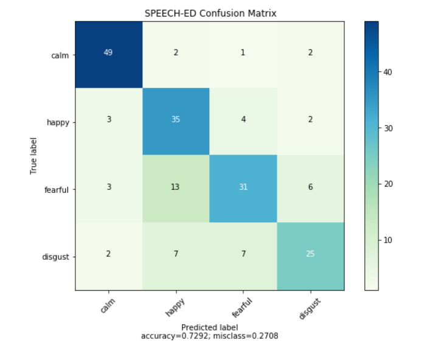

# SPEECH-EMOTION-BHAWANA-DETECTION-on-live-voice

In this project we build a model to recognize emotion from speech using the librosa and Multi Layer Perception Classifier (MLPClassifier) and RAVDESS Dataset. This will be able to recognize emotion from sound files. We will load the data, extract features from it, then split the dataset into training and testing sets. Then, we’ll initialize an MLPClassifier and train the model. Finally, we’ll calculate the accuracy of our model.

## RAVDESS Dataset :
This is the Ryerson Audio-Visual Database of Emotional Speech and Song dataset, and is free to download. This dataset has 7356 files rated by 247 individuals 10 times on emotional validity, intensity, and genuineness. The entire dataset is 24.8GB from 24 actors.

Dataset source link: https://www.kaggle.com/uwrfkaggler/ravdess-emotional-speech-audio

## Technology used :
-openCV (Opensource Computer Vision)
-Python
-Librosa

## Feature Extracted:

Librosa library is used to extract features from sound and music file. Features extracted are mfcc, chroma and mel features.

### mfcc: 
	Mel Frequency Cepstral Coefficient, represents the short-term power spectrum of a sound
### chroma: 
	Pertains to the 12 different pitch classes
### mel: 
	Mel Spectrogram Frequency

## Accuracy Achived: 
On testing our model we achieved an accuracy of 75.97% which is good enough!

## UI:
I have used flask framework for UI part.

## Step - 1

## Step - 2

## Step - 3

## Step - 4

## Step - 5

## Confusion Matrix

